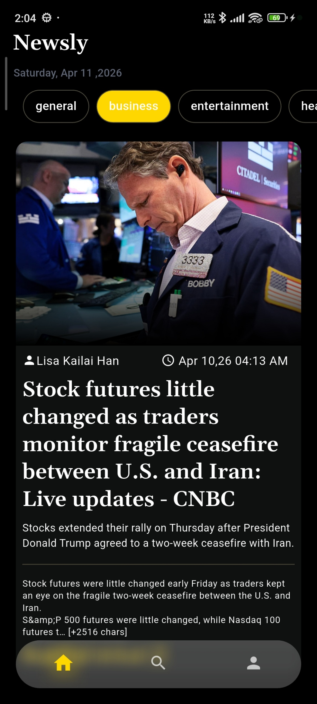

# 📰 Newslyy Website  
### *A Modern News Website UI Showcase*  

  
  

  
  
  
  

---

## 🌐 Live Preview  
🚀 **Live Website:** https://newslyyinfo.vercel.app  

---

## 📌 About the Project  

**Newslyy Website** is a modern and responsive news platform UI built to deliver a clean browsing experience with an attractive design.

This project is created as a **web showcase** of a news website layout, focusing on UI/UX, responsiveness, and a professional look.

---

## ✨ Key Highlights  

✅ Modern and premium UI layout  
✅ Fully responsive (Mobile + Tablet + Desktop)  
✅ Clean typography & spacing  
✅ Smooth user-friendly navigation  
✅ Optimized UI for news readability  
✅ Minimal & professional design approach  
✅ Fast and lightweight pages  

---

## 🖼️ UI Preview  

### 🏠 Home Screen  

### 📰 News Section  

📌 *Upload your screenshots inside a folder named `screenshots` and keep the same file names.*

---

## 🛠️ Tech Stack  

| Technology | Usage |
|----------|--------|
| **Next.js** | Frontend framework |
| **TypeScript** | Type-safe development |
| **Tailwind CSS** | UI styling |
| **Vercel** | Hosting & deployment |

---

## 🎯 Goal of this Project  

The main purpose of this website is to create a **real-world news website UI** that can be used as:

- A portfolio showcase project  
- A UI reference for modern websites  
- A base template for future news applications  

---

## 👨‍💻 Author  

**Shaan Patel**  
💼 Software Developer Intern (Flutter)  
🔗 GitHub: https://github.com/Shaan013  

---

## ⭐ Support  

If you like this project, consider giving it a ⭐ on GitHub — it motivates me to build more projects like this!

---

### 🚀 Made with passion & clean UI focus.
